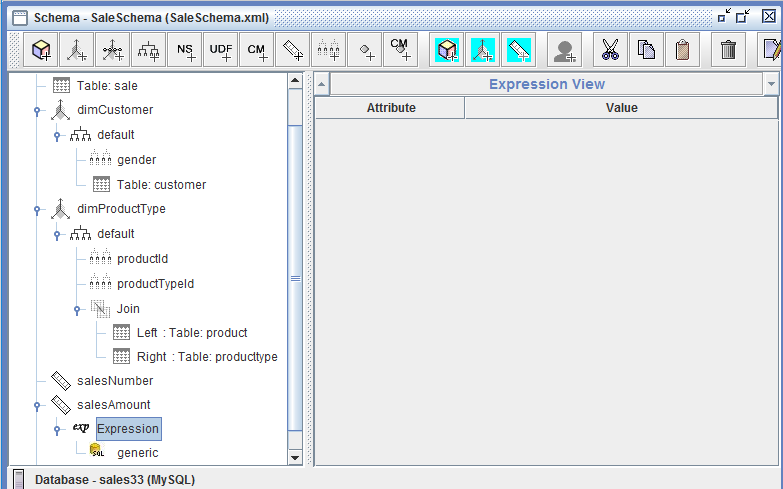

## saiku使用所需应用
- [saiku community version](http://community.meteorite.bi/) bi工具
- [Mondrian Schema Workbench](http://sourceforge.net/projects/mondrian/files/schema%20workbench/) 用于创建schema文件
- [MySQL](http://dev.mysql.com/downloads/mysql/)

## 准备工作
1. 下载saiku community version，将saiku-server解压，修改\saiku-server\tomcat\conf\server.xml中tomcat访问端口位8085，默认为8080
2. 运行db.sql，导入相关数据至数据库sales33
3. 下载Schema Workbench，并将mysql-connector-java-x.x.xx.jar复制到\schema-workbench\drivers\

## 创建schema文件
saiku community version并不提供schema文件的制作功能。saiku enterprise edition提供对于schema文件的新建功能（但是不提供编辑）。因此选取Mondrian Schema Workbench作为制作工具。

## 验证结果
新建mdx query，载入对应的schema文件，输入mdx查询语句，点击Execute
> select  
>       {[Measures].salesNumber,[Measures].salesAmount,[Measures].avgPrice}  
> on columns,  
>       {([dimProductType].[allProduct],[dimCustomer].[allCustomer])}  
> on rows  
> from[salesCube]

## 配置saiku
1. 前往[http://licensing.meteorite.bi](http://licensing.meteorite.bi)申请license，保存后可下载license文件

2. 启动saiku，访问[http://localhost:8085/upload.html](http://localhost:8085/upload.html)上传license文件，然后可登录admin/admin
3. 前往“管理控制台”，上传schema文件

4. 添加Data Source

5. 刷新页面后，新建查询，选择SalesCube  

## 参考资料
以上基于[http://blog.csdn.net/neweastsun/article/details/43490663](http://blog.csdn.net/neweastsun/article/details/43490663)